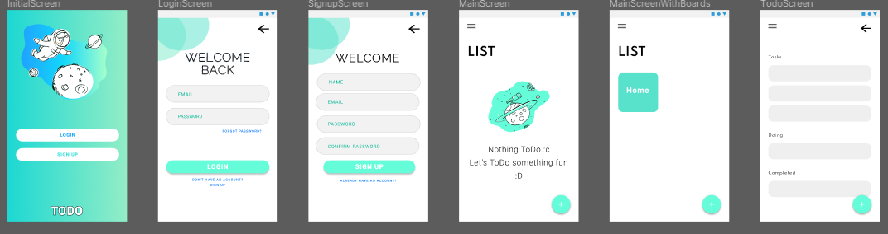

# App ToDo Application
<p align="center">
  
</p>

<h1 align="center">App ToDo Applicaton</h1>
<p align="center">A kanban board style task manager.</p>

<h3 align="center">
  <a href="#" target="_blank">
    
  </a>
  <a href="#" target="_blank">
    
  </a>
</h3>

<br />

## Preview

Sample preview:



## Installation

Download the latest version of node.

## Run locally

After clone of the repository, open its folder and install dependencies with:

```shh
node install
```

Run it using:

```sh
ionic serve
```
## Authors

:snowflake: **Akms**
- Github: [@akms0](https://github.com/akms0)

:rice_ball:	 **Nyanham**
- Github: [@nyanham](https://github.com/nyanham)

:ramen: **Yuuta**
- Github: [@YuutaDragon](https://github.com/YuutaDragon)

## Show your support

Give a ⭐️ if this project helped you!
